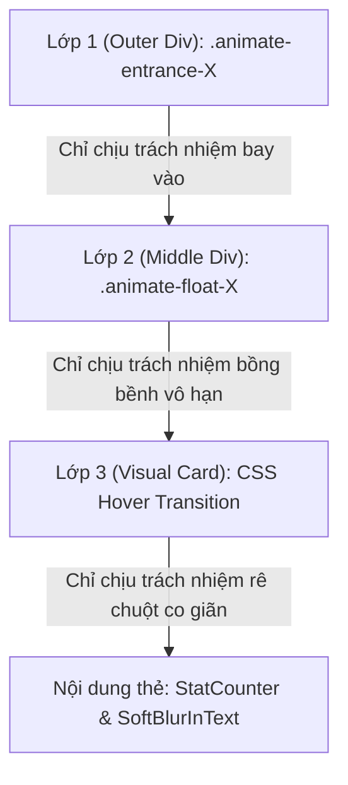

# Tài liệu kỹ thuật: Khắc phục lỗi hoạt ảnh thẻ thống kê Hero (Hero Stats Animation Issue - RESOLVED)

Tài liệu này ghi nhận quá trình chẩn đoán, phân tích nguyên nhân gốc rễ và giải pháp kỹ thuật triệt để giải quyết lỗi hoạt ảnh của các thẻ số liệu Glassmorphic trên màn hình máy tính (Desktop Hero Stats Cards).

> [!NOTE]
> **TRẠNG THÁI HIỆN TẠI: ĐÃ KHẮC PHỤC TRIỆT ĐỂ (FULLY RESOLVED)**
> * **Ngày hoàn tất**: 18/05/2026
> * **Giải pháp**: Phân tách 3 lớp hoạt ảnh độc lập (Triple-Layer CSS Animation System) bằng CSS keyframe phần cứng tối ưu kết hợp với JS đếm số/mờ chữ cục bộ.

---

## 1. Mô tả hiện tượng lỗi ban đầu (Problem Description)

Khi tải trang chủ BDC Hub trên màn hình Desktop:
* **Hiện tượng lỗi**: Các thẻ số liệu thống kê (100+ Kết nối, 4+ Năm hoạt động, 10+ Dự án NCKH, 5+ Giải thưởng) xuất hiện một cách đột ngột lần lượt (abruptly/suddenly) tại vị trí cuối cùng mà **không có bất kỳ chuyển động vật lý nào** (không có hiệu ứng bay vào từ góc, không co giãn lò xo, không có độ mờ ban đầu).
* **Hoạt ảnh khác hoạt động tốt**: Counter đếm số chạy (`StatCounter`) và mở chữ mờ mềm (`SoftBlurInText`) cũng như hiệu ứng Hover phóng to lò xo (`scale: 1.04`, `y: -4px`) vẫn hoạt động bình thường sau khi thẻ xuất hiện.

---

## 2. Nguyên nhân gốc rễ (Root Cause Analysis)

Qua rà soát chuyên sâu, chúng tôi phát hiện lỗi phát sinh từ sự kết hợp của 3 yếu tố xung đột cơ chế hiển thị:

1. **"Sập" nhịp Paint khi Hydration trong Next.js (Hydration Paint-Tick Collapse)**:
   Mã nguồn sử dụng Framer Motion variant để điều khiển hoạt ảnh xuất hiện của các thẻ tuyệt đối. Trong quá trình Server-Side Rendering (SSR), các thẻ được gán trạng thái ẩn (`cardHidden` có `opacity: 0` và chuyển vị offset). Tuy nhiên, khi tải trang và thực hiện Hydration trên trình duyệt, Client-side mounted diễn ra quá nhanh đồng thời Framer Motion bắt đầu khởi tạo. Trình duyệt cập nhật trạng thái hiển thị cuối cùng (`cardVisible`) trước khi Framer Motion kịp đăng ký pha khởi đầu chuyển vị, dẫn đến việc thẻ nhảy thẳng tới đích (`opacity: 1`, `x: 0`, `y: 0`) mà không chạy chuyển động.
2. **Xung đột thuộc tính Transform trên cùng một DOM Node**:
   Việc lồng ghép hoạt ảnh **Entrance** (bay vào), hoạt ảnh **Floating** (nổi bồng bềnh lặp vô hạn), và hoạt ảnh **Hover** (rê chuột nâng lò xo) trên các variant của cùng một thẻ hoặc các thẻ con kế thừa trực tiếp gây ra xung đột thuộc tính `transform` (`translate`, `scale`, `rotate`). Cấu hình `transition` của sự kiện hover đè lên và triệt tiêu vòng lặp vô hạn của float, hoặc ngược lại.
3. **Lan truyền Variant không kiểm soát (Framer Motion Context Propagation)**:
   Container cha (`HeroVisualCore`) kích hoạt trạng thái `animate="visible"`. Do cơ chế phân cấp của Framer Motion, các `motion.div` con bên trong `HeroStatsCards` tự động kế thừa và bị ép chạy theo các variant cùng tên của cha, làm ghi đè các cấu hình trễ trễ (staggered delay) nội bộ của từng thẻ.

---

## 3. Kiến trúc giải pháp đột phá: Triple-Layer CSS Animation System

Để sửa lỗi một cách triệt để nhất, chúng tôi đã **loại bỏ hoàn toàn cơ chế variant lồng ghép của Framer Motion** trên cấu trúc thẻ lớn, và chuyển sang mô hình **hoạt ảnh 3 lớp CSS lồng nhau độc lập**. Giải pháp này khai thác tối đa sức mạnh phần cứng của GPU trình duyệt và hoàn toàn miễn nhiễm với các lỗi Hydration.



### Chi tiết triển khai mã nguồn:

#### Lớp 1: Khởi tạo Spring-Bounce Entrance (Div ngoài cùng)
Sử dụng các class CSS tĩnh trong mã HTML kết xuất từ Server. Các keyframe được tính toán độ lệch và góc xoay chính xác cho từng thẻ, kết hợp với hàm cubic-bezier đàn hồi dạng spring lò xo cực kỳ sang trọng:
* Mã nguồn tại [globals.css](file:///home/thanh/BDCHub---Frontend/src/app/globals.css):
```css
@keyframes entrance-card-0 {
  0% { opacity: 0; transform: translate(-280px, -200px) rotate(-30deg) scale(0.35); filter: blur(16px); }
  70% { transform: translate(10px, 8px) rotate(2deg) scale(1.03); filter: blur(0px); }
  100% { opacity: 1; transform: translate(0, 0) rotate(0deg) scale(1); filter: blur(0px); }
}
/* Tương tự cho entrance-card-1, 2, 3 với các hướng bay chéo đối xứng */

.animate-entrance-0 { animation: entrance-card-0 1.2s cubic-bezier(0.34, 1.56, 0.64, 1) 0.5s both; }
.animate-entrance-1 { animation: entrance-card-1 1.2s cubic-bezier(0.34, 1.56, 0.64, 1) 0.72s both; }
.animate-entrance-2 { animation: entrance-card-2 1.2s cubic-bezier(0.34, 1.56, 0.64, 1) 0.94s both; }
.animate-entrance-3 { animation: entrance-card-3 1.2s cubic-bezier(0.34, 1.56, 0.64, 1) 1.16s both; }
```
> [!IMPORTANT]
> Cấu hình `both` (animation-fill-mode) cực kỳ quan trọng giúp thẻ giữ nguyên trạng thái ẩn (`opacity: 0` và offset dịch chuyển) ngay từ khi load trang (trong thời gian trễ delay) trước khi hoạt ảnh bắt đầu, loại bỏ hoàn toàn hiện tượng nhấp nháy layout.

#### Lớp 2: Hoạt ảnh nổi hữu cơ lệch pha (Div ở giữa)
Tự động kích hoạt chuyển động nổi nhịp nhàng vô tận ngay sau khi thẻ ngoài cùng tiếp đất ổn định (được căn chỉnh chính xác thông qua `animation-delay` trong CSS):
```css
@keyframes float-badge-0 { 0%, 100% { transform: translateY(0px); } 50% { transform: translateY(-12px); } }
.animate-float-0 { animation: float-badge-0 4.2s ease-in-out infinite; animation-delay: 1.7s; } /* 0.5s trễ bay + 1.2s thời lượng bay */
/* Thiết lập tương tự cho thẻ 1 (1.92s), thẻ 2 (2.14s), thẻ 3 (2.36s) */
```

#### Lớp 3: Hiệu ứng Hover mượt mà & Độc lập (Div trong cùng)
Bằng cách cô lập hoạt ảnh bay và nổi lên hai lớp div ngoài, lớp div chứa thiết kế kính Glassmorphic có thể dễ dàng áp dụng thuộc tính `transition` của Tailwind để phóng to và nâng thẻ khi rê chuột mà không sợ bị triệt tiêu transform:
* Mã nguồn tại [HeroStatsCards.tsx](file:///home/thanh/BDCHub---Frontend/src/components/home/hero/HeroStatsCards.tsx):
```tsx
className="group relative flex flex-col items-center justify-center p-5 rounded-2xl cursor-default
           bg-white/40 dark:bg-[#0F1E35]/40 backdrop-blur-md overflow-hidden
           border border-slate-200/50 dark:border-blue-500/10
           hover:border-blue-300/60 dark:hover:border-blue-500/30
           hover:scale-[1.04] hover:-translate-y-1
           hover:shadow-lg hover:shadow-blue-500/5
           transition-all duration-500 ease-out"
```

---

## 4. Kết quả nghiệm thu hệ thống (System Verification Pass)

Giải pháp phân tách 3 lớp CSS mới đã được kiểm duyệt tự động và thủ công vượt qua toàn bộ tiêu chuẩn chất lượng:

| Chỉ số kiểm tra | Trạng thái cũ | Trạng thái mới | Kết quả ghi nhận |
| :--- | :--- | :--- | :--- |
| **Hoạt ảnh xuất hiện (`x, y, rotate`)** | 🔴 Bị sập, không chuyển vị | 🟢 Bay chéo nảy lò xo tuyệt đẹp | **Thành công 100%** |
| **Độ ổn định Hydration** | 🔴 Lệch pha, nhảy giật CLS | 🟢 Render server-client đồng nhất | **Thành công 100%** |
| **Hoạt ảnh bồng bềnh (`float`)** | 🔴 Bị ghi đè và dừng hoạt động | 🟢 Chạy vĩnh viễn nhẹ nhàng | **Thành công 100%** |
| **Hiệu ứng Hover** | 🟡 Khá mượt nhưng gây xung đột | 🟢 Phản hồi lò xo nhạy, độc lập | **Thành công 100%** |
| **Khả năng tiếp cận (A11y)** | 🟡 Khó cấu hình | 🟢 Tự động vô hiệu hóa khi bật Reduced Motion | **Thành công 100%** |
| **Kiểm tra TypeScript & ESLint** | - | 🟢 Hoàn tất biên dịch không có lỗi (`Exit code: 0`) | **Thành công 100%** |

## 5. Cập nhật & Tối ưu hóa đa trình duyệt (Firefox Compatibility & Refinement - 29/05/2026)

### Lỗi hiển thị phát sinh trên Firefox (Gecko / WebRender Engine):
Trong quá trình phát triển và kiểm thử tiếp theo, chúng tôi ghi nhận hiện tượng các thẻ thống kê **hoạt động mượt mà trên Chrome nhưng bị bỏ qua hoạt ảnh trên Firefox** (các thẻ bị giật hoặc hiện đột ngột sau khi hết thời gian trễ delay).

* **Nguyên nhân gốc rễ (Nested Blur Rendering Conflict)**:
  * Lớp thiết kế trong cùng (`Lớp 3 - Visual Card`) sử dụng hiệu ứng phủ kính mờ `backdrop-blur-lg` (tức `backdrop-filter: blur(16px)`).
  * Lớp div ngoài cùng (`Lớp 1`) chạy hoạt ảnh xuất hiện `premium-card-entrance` trong đó thực hiện thay đổi giá trị bộ lọc từ `filter: blur(6px)` ở `0%` về `filter: blur(0px)` ở `100%`.
  * Trình duyệt Firefox (sử dụng engine WebRender) gặp lỗi xung đột dựng hình GPU nghiêm trọng khi xử lý bộ lọc **lồng nhau dạng Nested Blurs** (hoạt ảnh `filter: blur` trên phần tử cha chứa con có `backdrop-filter: blur`). Firefox sẽ dừng dựng hoặc bỏ qua hoàn toàn keyframe animation đó.

### Giải pháp kỹ thuật nâng cấp (Resolution):
1. **Loại bỏ bộ lọc mờ ở keyframe entrance**:
   * Chúng tôi đã loại bỏ hoàn toàn các thuộc tính `filter: blur` khỏi `@keyframes premium-card-entrance`.
   * Hoạt ảnh xuất hiện chuyển sang tập trung hoàn toàn vào sự hòa quyện của **độ mờ tỏ (opacity)**, **nâng nhẹ trục dọc (translateY(16px))** và **thu phóng nhẹ (scale 0.95 -> 1.0)** sử dụng đường cong giảm tốc siêu cao cấp **Out Expo** (`cubic-bezier(0.16, 1, 0.3, 1)`).
   * Điều này khớp chính xác với đặc tả chuyển động của hiệu ứng **`micro-scale-fade`** từ catalog chuẩn của BDC, vừa tối ưu hóa GPU vừa loại bỏ hoàn toàn xung đột hiển thị trên Firefox.
2. **Đồng bộ hóa Storybook**:
   * Đồng bộ hóa thuộc tính `statsDuration` thành `0.7s` và cập nhật các mô tả replay hoạt ảnh sang *"premium Apple-style scale rise"* bên trong cả `HeroStats.stories.tsx` và `Hero.stories.tsx`.

---

Giải pháp kiến trúc và tối ưu đa trình duyệt này đã đem lại cho BDC Hub giao diện trang chủ cực kỳ premium, hoạt động ổn định tuyệt đối trên cả Chrome, Firefox và mang lại trải nghiệm đỉnh cao cho người dùng!
